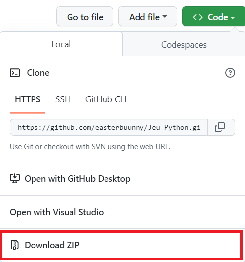

# Mini jeu en Python

Auteur : Laura Wang 

Version : v1.0.0

Date de création : 25/12/22

# Sommaire 
1. [Installation sous linux](#sous-linux)
2. [Installation sous windows](#sous-windows)
## Sous linux <a name="sous-linux"></a>
### Installation 
Récupere le répertoire en ligne de commande:
```shell
git clone https://github.com/easterbuunny/Jeu_Python.git
```

### Pré installation 
- Verifier si vous avez bien python installer en suivant les commandes du site :
[Install python](https://doc.ubuntu-fr.org/python)
- Installer le module ```pygame``` avec le gestionnaire de paquet python :
```shell
pip install pygame
```
- Lancer le fichier ```main.py``` à partir d'un IDE ```OU``` lancer depuis un terminant avec : 
```shell
python3 main.py
```

## Sous windows <a name="sous-windows"></a>
### Installation 
- Télécharger le répertoire ```Jeu_Python.zip``` et décompresser



### Préinstallation 
- Verifier si python est bien installer sur la machine : 
```shell
python --version
```
  - Si python est déjà installer vous devez avoir ceci afficher à l'écran ```Python 3.9.13```
  - Sinon installer le : [Ptyhon Download](https://www.python.org/downloads/) ou dans Microsoft Store
- Verifier si pip est installer sur la machine avec 
```shell
pip --version
```
  - Si pip est déjà installer vous devez avoir ```pip 22.3.1 ...```
  - Sinon installer le : 
  ```shell
  python get-pip.py
  ```. A la fin de l'installation vous devez avoir ```Successfully installed pip-22.3.1 wheel-0.38.4```

### Lancer l'application
- Ouvrir l'invite de commande :
```Windows Key + R``` ensuite ```cmd```

- Vous pouvez voir le contenu du repertoire avec la commande ```dir```
- Déplacer dans le repertoire que vous venez de télécharger avec la commande ```cd```
- Installer le gestionnaire de packet avec la commande 
```shell
python -m pip install pygame
```
- Lancer l'application avec la commande 
```shell 
py main.py
```

## Règle du jeu
### Objectif 
Le but du jeu est de survivre dans la partie en tuant les ennemis.
### Commandes
- Deplacer à gauche et a droite : Flèche gauche & Flèche droite
- Attaquer : ```K_SPACE```
- Jouer : "Play" ou ```K_RETURN```  
- Accueil : ```K_Q```
- Fermer le jeu : Sur l'écran d'acceuil ```K_Q```
